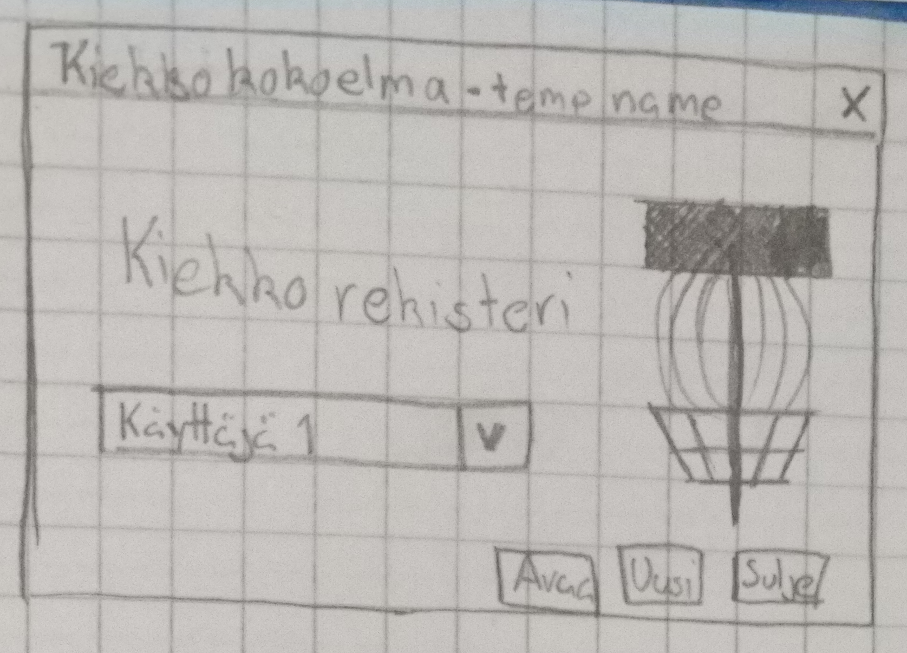
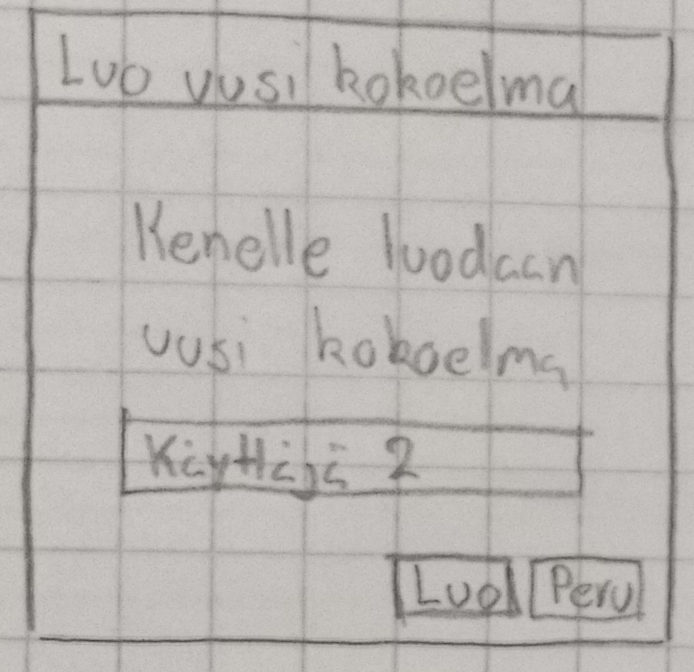
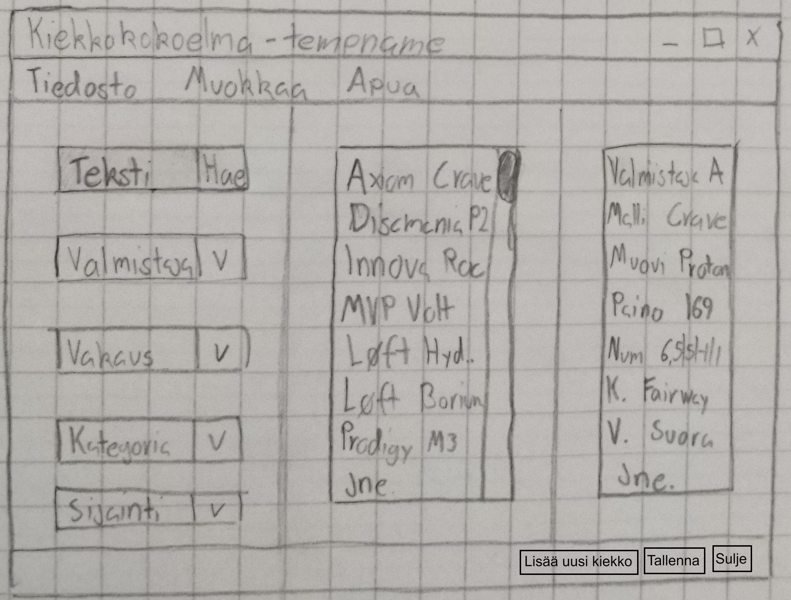

# Ohjelmointi 2 - 2021 -kurssin esisuunnitelma (vaihe 1)

Ryhmä:
> Thomas Semenius (M2963@student.jamk.fi)  
> https://github.com/Semenius/ohj2

*Pohja kevään 2020 harjoitustöiden GIT-repoille*  
*Lue käyttöohjeet TIMistä: <https://tim.jyu.fi/view/kurssit/tie/ohj2/tyokalut/git/ohj2git#fork>*

# 1. Frisbeegolf kiekkojen rekisteri

Rekisteri on kehitetty seuraamaan omaa kiekkovarastoani ja mahdollistamaan hukkuneen kiekon kadottamisen aiheuttamaa tuskaa selaamalla suoraan varastosta nopeasti vaihtoehtoiseta korviketta kyseiselle kiekolle.

## 1.1 Mitä tietoja tarvitaan?

- Valmistaja
- Mallin nimi
- Muovi
- Paino
- Lentotaulukon numerot *kaikki yhdessä vai erikseen*  
- Kiekkon kategoria (Driver, Fairway, Midrange, Putt & Approach)
- Vakaus (Yli, ali, suora)
- Sijainti (Bägi, varasto, hukattu, myyty, muu)
- Väri
- Lisäinfo (Stamp, nimmaria, jne)

## 1.2 Mitä ominaisuuksia rekisteriltä halutaan?

- Kiekon lisääminen
  - Kiekon poistaminen?
- Yksittäisen kiekon hakeminen
- Monen kiekon hakeminen
- Yksittäisen kiekon tietojen muokkaaminen
- Valmistajan lisääminen menutoiminnosta 

## 1.3 Tallennustiedostojen muoto

**kayttajat.dat**  
Kirjautumisen yhteydessä olevat käyttäjätieto, joka johdattaa kiekkorekisteriin tai uuden luonti.

> ID  | Nimi      | *(Salasana?)*  
> 1   | Thomas    | salasana123  
> 2   | Käyttäjä1 | asdfqwer1!  
> 3   | Käyttäjä2 | p422w0rd  

**kiekot.dat**  
Kiekot ja niiden kaikki tiedot listattuna.

> ID  | Valmistaja | Malli | Muovi  | Paino | Lentotaulukko | Kategoria | Vakaus  | Sijainti  | Väri      | Lisäinfo  
> 1   | Axiom      | Crave | Proton | 169g  | 6.5, 5, -1, 1 | Fairway   | Suora   | Bägi      | Punainen  | Vesimelon stamp  
> 2   | Discmania  | P2    | D      | 175g  | 2, 3, 0, 1    | Putter    | Suora   | Varasto   | Valkoinen |  

# 2. Ohjelman käyttö

## 2.1 Ohjelman käynnistys.

Ohjelma avataan joko pikakuvakkeella tai komentoriviltä komennolla
> java -jar kerho.jar

Ohjelman käynnistyessä tulee esiin vastaavanlainen näkymä, josta dropdown menulla valitaan käyttäjä. Defaultina tarjoaa ensinmäistä luotua kokoelmaa:

Tästä menusta on mahdollista lisätä myös uusi kokoelma uudelle käyttäjälle.

## 2.2 Pääikkuna

Päädyttyä pääikkunaan tulee esiin vastaavanlainen kuva

### 2.2.1 Hakeminen

Vasemmalta löytyy vaihtoehto haut, joista osa toimii tekstikentällä ja osa dropdownista. Dropdownilla toimivat ovar merkitty (sulkein) poislukien lisätiedot sekä valmistaja. Hakutermi saa olla mistä kohtaan vaan kiekon nimeä, joko valmistajaa tai mallin nimeä.

### 2.2.2 Muokkaaminen

Valittun kiekon tietoja voidaan katsoa oikealla tarkemmin, joka mahdollistaa tietojan suoran muokkaamisen. <!-- Onko tallentaminen mahdollista tehdä automaattiseksi?-->

## 2.3 Menutoiminnot yksityiskohtaisemmin

Kuvassa ylhäällä näkyvät kolmessa eri osaa, kuten yllä olevassa kuvassa:

> Tiedosto  
> Muokkaa  
> Apua

### 2.3.1 Tiedosto

Tämä sisältää perus tallenna, *tulosta?* , kirjaudu ulos ja sulje painikkeet.

### 2.3.2 Muokkaa

Sisältää lisää kiekko, lisää valmistaja.

### 2.3.2 Apua

Tämän alta löytyy apua, tietoja ja versio.
